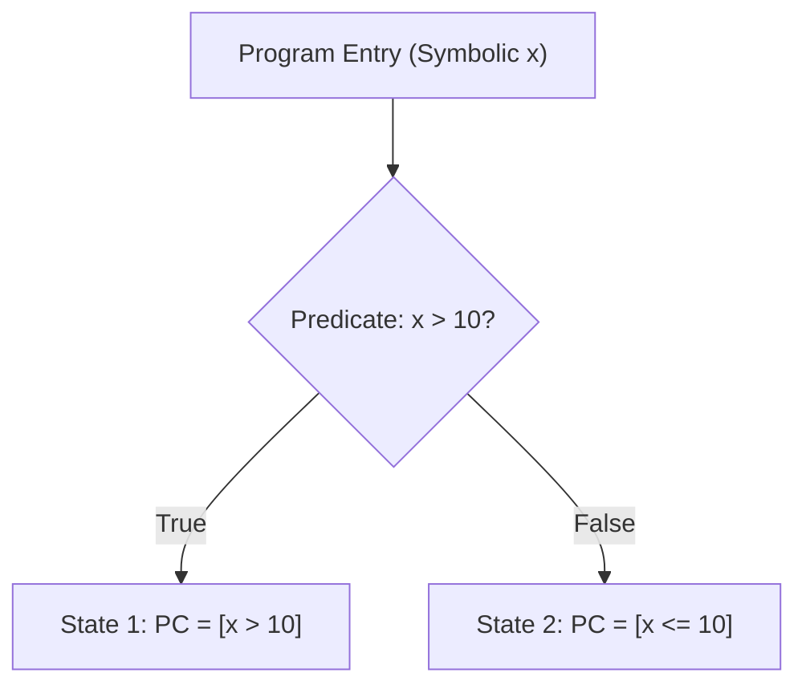

# Symbolic Execution Path Explorer Skill

Robust, zero-dependency Python implementation of **Forward Symbolic Execution with Path Condition Tracking**.

## Features
- **Branch Bifurcation**: Splits execution paths upon branch predicates into complementary symbolic states.
- **Path Condition Accumulation**: Preserves first-order logic constraints over symbolic variables.
- **Zero External Dependencies**: Pure Python standard library.
- **Native MCP Protocol**: JSON-RPC 2.0 stdio server compatible with Claude Desktop, Cursor, and Windsurf.

## Architecture

